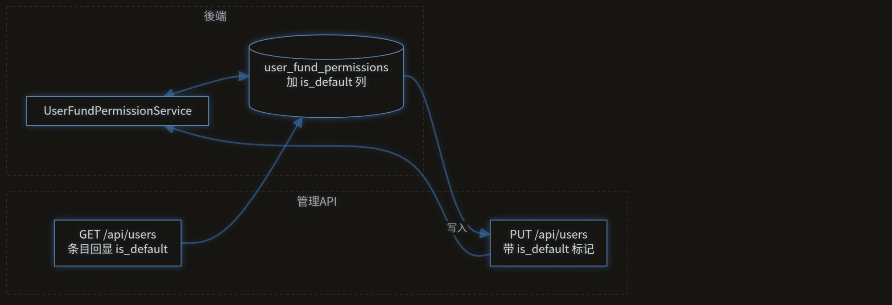
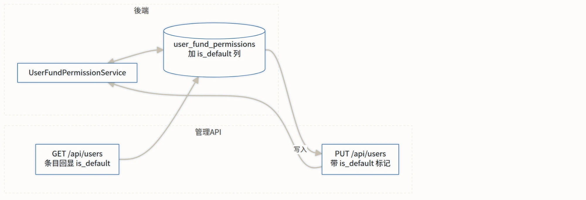
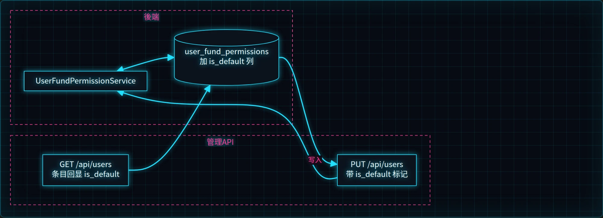
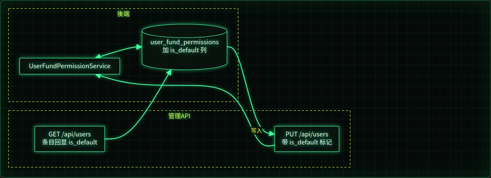
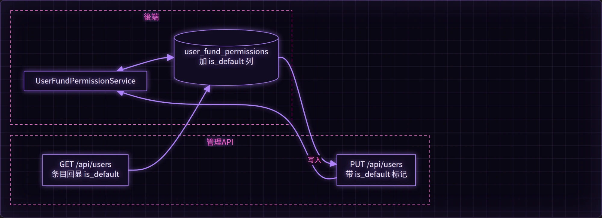
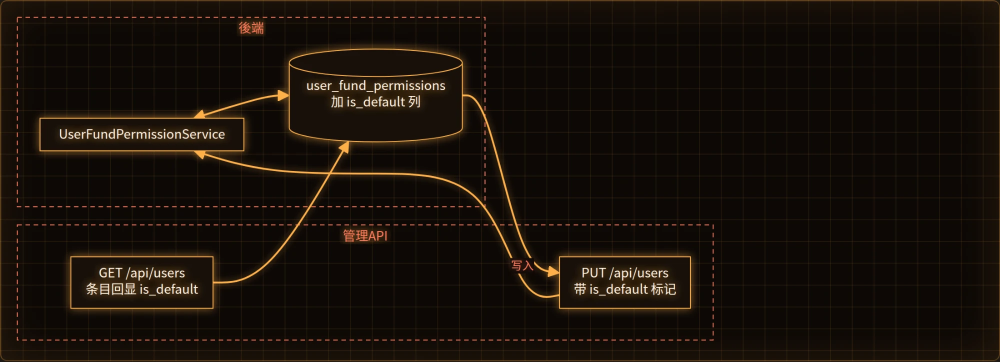
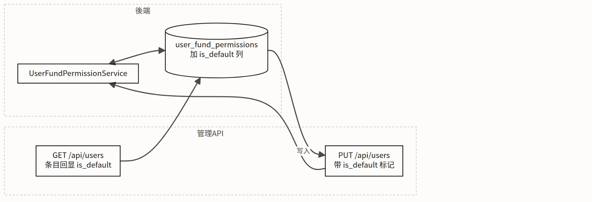

<div align="center">

# MoYun

**A Chinese-first theme for Obsidian — typography rebuilt for Han characters**

# 墨韵 MoYun

**一个中文优先的 Obsidian 主题 —— 为汉字的阅读与写作重新设计排版**

> In the community directory the theme is called **MoYun** (the directory only allows
> Basic Latin in theme names). 墨韵 is its Chinese name: 墨 *ink*, 韵 *resonance*.
> 在社区目录里名为 **MoYun**（官方要求主题名只用基本拉丁字符），中文名「墨韵」。


</div>

---

<a id="sponsor"></a>

## Sponsor / 赞助

**English** — MoYun is a spare-time project: reading standards, measuring real browser
behaviour, and writing the checks that keep it honest. If it makes reading Chinese in
Obsidian a little more comfortable, you can buy me a cup of tea. **Entirely optional —
every feature stays free.**

**中文** —— 墨韵是业余时间的作品：查规范、实测浏览器行为、写检查脚本，
光是为了搞清「为什么 Mermaid 图里的字会隐形」就翻过 Obsidian 的 asar 包。
如果它让你的中文阅读舒服了一点，欢迎扫码请我喝杯茶 —— **完全自愿，不影响任何功能**。

<table>
  <tr>
    <td align="center" width="50%">
      
      <br /><b>WeChat Pay / 微信支付</b>
    </td>
    <td align="center" width="50%">
      
      <br /><b>Alipay / 支付宝</b>
    </td>
  </tr>
</table>

Three things that help just as much as money / 不花钱也能帮上忙：

1. Star or vote for it in the [community directory](https://community.obsidian.md/themes) /
   在社区目录里给它点个赞；
2. Report what is broken — the dark-mode table and the invisible Mermaid text were both
   found by users / 提 Issue 告诉我哪里不好用；
3. Recommend it to anyone who writes Chinese in Obsidian / 推荐给身边用中文写笔记的人。

---

## English

### Why another theme?

Obsidian has many excellent themes, but almost all of them are designed for English prose.
The problem is not colour — it is that the typographic rules simply do not hold for Chinese.
Take the six issues that matter most when reading Han characters on screen:

| Issue | What English defaults do | What Chinese needs |
|---|---|---|
| Line height | 1.3–1.4 is comfortable | Han glyphs are dense squares; 1.4 feels cramped, 1.7–1.9 reads well |
| Script mixing | No spacing rule between scripts | A quarter-em gap between Chinese and Latin/digits |
| Punctuation | Full-width marks keep their full box | Consecutive full-width marks should compress |
| Paragraphs | Block paragraphs, blank line between | First-line indent of two characters, no blank line |
| Line breaking | Breaks at spaces | Must not start a line with closing punctuation, nor end with opening punctuation |
| Headings | Weight 700+ reads as "bold" | At 700+ Chinese strokes bleed together; 650 plus whitespace reads better |

MoYun rebuilds all six from the ground up, on top of the CSS Text Level 4 features that
Chromium gained recently (`text-autospace`, `text-wrap: pretty`, `line-break: strict`) —
no plugin, no JavaScript, no changes to your notes.

### What it does differently

1. **Chinese typography as the default, not a preset.** Inter-script spacing, orphan control,
   1.8 line height, two-character first-line indent (with a careful exemption list for lists,
   quotes, tables, code, maths and image-only paragraphs), weight 650 headings, and no fake
   italics — Chinese has no true italic, so emphasis uses weight and colour instead.
2. **Government-document mode, on by default.** A faithful implementation of GB/T 9704-2012
   (the Chinese official-document standard): FangSong body text, SimHei for first-level and
   KaiTi for second-level headings, justified text, full-grid tables, and A4 page rules when
   printing. Prefer general-purpose typography? Turn it off in Style Settings. Dark mode
   changes only the paper and ink colours — the document rules stay intact.
3. **Eight accent colours** drawn from traditional Chinese pigments — 青花 qinghua (blue),
   朱砂 zhusha (cinnabar), 竹青 zhuqing (bamboo), 藤紫 tengzi (wisteria), 秋香 qiuxiang
   (olive), 黛青 daiqing (dark cyan), 胭脂 yanzhi (rouge), 松烟 songyan (ink grey) — each
   calibrated against WCAG AA contrast in both light and dark mode.
4. **Paper-white day mode, ink-black night mode.** The dark theme is not an inversion: it uses
   warm off-white text on deep ink instead of pure white on pure black, which is far easier on
   the eyes over a long evening.
5. **Resolution-adaptive sizing.** Font size and measure scale with window width, so text stays
   comfortable on a 4K display instead of shrinking into unreadability. Obsidian's own font
   size and font-family settings are respected rather than overridden — themes should not fight
   the host.
6. **Mermaid diagrams are themed too**, in six selectable styles: ink (follows the accent
   colour), four neon variants (cyan, matrix green, violet, amber, each on its own dark canvas),
   and a print-friendly black-and-white line style.
   Diagrams are pure line art: every shape is an outline with no fill at all, boxes have rounded
   corners, and **fills written in the diagram source are not rendered either** — a `classDef` or
   `style` that asks for a background is ignored (enforced with `@layer`, because Mermaid injects
   those as ID-scoped `!important` rules). Labels keep a text-coloured halo instead of a backing
   rectangle, so a connector cannot cut through the words.
   In-diagram text also carries its own font and text metrics, so a diagram keeps its shape when
   something moves it out of the note: the zoom viewer, a Canvas card, an export.
   The same rule covers every diagram type the renderer ships — flowcharts, sequence, state, class,
   ER, mindmap, timeline, requirement, git, journey, quadrant, xy charts, gantt, block and sankey —
   because each of them names its boxes differently (`node`, `node-bkg`, `reqBox`,
   `branchLabelBkg`, `journey-section`, `quadrant rect`, `rect.background`, …) and a theme that
   styles only the common ones leaves the rest in the renderer's default palette. Shapes that
   *encode* data — pie slices, gantt and journey bars, git commits, sankey links, chart bars, data
   points — keep their fills, because there the colour and the length are the information.

### Diagram sizing

Box size is decided by Mermaid's own layout engine, not by CSS: `flowchart.wrappingWidth` caps a
label at 200 px, so long Chinese labels fold into narrow strips. No theme can change that — a theme
is CSS. The companion plugin **Zoomable Reader** does it instead (boxes follow the text, the way
PlantUML lays them out); install it if you want roomier diagrams.

### Install

1. **Settings → Appearance → Themes → Manage**, search for `MoYun`, install, then select it.
2. Install the **Style Settings** community plugin — it unlocks the theme's 37 settings.
3. Restart Obsidian or switch theme once after updating, so the new CSS is picked up.

Manual install: copy `theme.css` and `manifest.json` into `<vault>/.obsidian/themes/MoYun/`.

### Settings

Style Settings exposes 37 settings in eight groups, all documented — each one explains the
trade-off rather than just offering a slider:

| Group | What is in it |
|---|---|
| 📄 Document tone | Government style (on), justify, indent |
| 🎨 Colours | The eight accent colours |
| 🀄 Chinese typography | Line height, paragraph spacing, letter spacing, indent, punctuation |
| 🔤 Fonts | Body / heading / code families, font size tuning |
| 📐 Line & measure | Measure (characters per line), editor padding, adaptive sizing |
| 🖥 Interface | Compact UI, tab and sidebar details |
| ✨ Content | Diagram style, heading numbers, rainbow folders, image grid and more |
| ⚙️ Advanced | Print, immersive mode, plugin compatibility |

### Diagram styles

Nodes are drawn as **coloured outlines with a transparent interior** — the stroke and the text
carry the meaning, the box itself has no fill, so a diagram looks the same over any background
(note, board, or the image viewer). Edge labels keep an opaque background on purpose: they sit on
top of a line, and without a backing the connector would cut through the text. Shapes that encode
data with colour (pie slices, Gantt bars) keep their fills.

Mermaid diagrams are themed too, and there are six styles to choose from in Style Settings.
All seven images below are **real renders** (same diagrams, same Mermaid version and the same
initialisation arguments Obsidian uses), not mock-ups. Regenerate them any time with
`node tools/make-mermaid-gallery.mjs`.

<table>
  <tr>
    <td align="center" width="50%">
      <br />
      <sub><b>Ink</b> · dark — follows the theme, outlines and glow use the accent colour</sub>
    </td>
    <td align="center" width="50%">
      <br />
      <sub><b>Ink</b> · light — transparent canvas, neutral edges, no colour noise</sub>
    </td>
  </tr>
  <tr>
    <td align="center" width="50%">
      <br />
      <sub><b>Cyber · cyan</b> — dark terminal canvas, neon outlines, glowing edges</sub>
    </td>
    <td align="center" width="50%">
      <br />
      <sub><b>Cyber · matrix</b> — phosphor green, the most “terminal” of the set</sub>
    </td>
  </tr>
  <tr>
    <td align="center" width="50%">
      <br />
      <sub><b>Cyber · violet</b> — synthwave violet and magenta</sub>
    </td>
    <td align="center" width="50%">
      <br />
      <sub><b>Cyber · amber</b> — warm terminal, gentler for long evening reading</sub>
    </td>
  </tr>
  <tr>
    <td align="center" width="50%">
      <br />
      <sub><b>Minimal</b> · black-and-white line drawing — for printing and formal documents</sub>
    </td>
    <td align="center" width="50%">
      <sub>Every style keeps text contrast at or above WCAG AA (≥ 4.5:1) — enforced by<br />
      <code>tools/check-mermaid.mjs</code>, which also asserts that no inversion filter is<br />
      applied and cross-checks computed styles against real screenshot pixels.</sub>
    </td>
  </tr>
</table>

### Development

The theme is modular source plus a build step, not one huge CSS file:

```
src/ (36 modules)  →  node build.mjs  →  theme.css (~237 KB)
```

- **Build-time checks (`node build.mjs`)**: brace pairing, comment integrity, undefined design
  tokens, palette-layer misuse, invalid colour functions, self-referencing custom properties,
  Style Settings block structure (duplicate keys in that YAML block once broke the whole
  settings panel), and whether the committed `theme.css` is stale.
- **Visual verification (`node tools/verify.mjs`)**: renders the real Obsidian DOM with the real
  `app.css` in Chromium and asserts **59 computed styles in both light and dark mode** —
  including contrast ratios against WCAG AA, and that the editor and reading views agree.
- **Mermaid verification (`node tools/check-mermaid.mjs`)**: renders real diagrams with
  Obsidian's own initialisation arguments, checks every text element's contrast, asserts no
  inversion filter is applied, and cross-checks computed styles against real screenshot pixels.
- **Tests**: `npm test` (28 assertions over the project's own contracts).
- **Lean artifact**: the shipped `theme.css` carries no explanatory comments — they are
  nearly half the source and would be parsed by the browser on every load. Module banners and
  the Style Settings block are preserved. Run `node build.mjs --comments` if you want the
  fully annotated build to read alongside the source.

### Compatibility

MoYun requires **Obsidian 1.13.0 or newer**. The reason is not laziness: its core CJK
features build on CSS Text Level 4 properties that only reached Chromium in recent versions
(`text-autospace` needs Chromium 136). On an older build those declarations are simply
ignored — no crash, no broken layout, but half the point of the theme silently disappears.
Declaring a lower minimum would have been dishonest, so the requirement now matches what the
theme actually needs and what it is tested against (1.13.7, Chromium 150).

The theme only uses **public CSS variables** and standard properties. If a future Obsidian
renames an internal variable, the affected rule falls back to Obsidian's own default rather
than breaking the layout.

### Mobile

Mobile is where a Chinese theme is most likely to get in the way, so the theme is measured
against Obsidian's own mobile rendering instead of being eyeballed. `node tools/check-mobile.mjs`
loads the same real Obsidian DOM and `app.css` twice in a phone-sized viewport — once without the
theme (native baseline), once with it — and compares font size, column width, characters per line,
visible lines per screen and horizontal overflow. 95 assertions across five viewports.

Measured at 390x844 with Obsidian's default 16px font size:

| | Obsidian native | MoYun |
|---|---|---|
| Body text | 16px | 16px |
| Characters per line | 21.4 | 21.4 |
| Vertical gutter | 8px | 16px |
| H1 | 25.9px (32px in govdoc style) | 28px |
| Visible lines per screen | 35.2 | 29.3 |

Three things are worth knowing:

- **The theme does not enlarge text on mobile.** Body size matches Obsidian's own; the gap in
  lines per screen comes from the 1.8x CJK line height, which is a deliberate reading choice and
  is adjustable in Style Settings.
- **Your phone's font size is a device setting.** It lives in `.obsidian/appearance.json`, which
  sync tools copy between desktop and phone. To let the two differ, exclude that file from sync —
  or use the theme's *Mobile font offset* setting, which only affects mobile.
- **Pinch-to-zoom cannot be enabled by a theme.** Obsidian is built on Capacitor, whose
  `zoomEnabled` option defaults to `false` ("Enable zooming within the Capacitor Web View") — a
  native, app-level switch no stylesheet can reach — and its HTML ships
  `maximum-scale=1.0, user-scalable=no`. Both are outside CSS. What a theme *can* fix is the
  consequence: **wide content is no longer shrunk into unreadability.**
  - Wide Mermaid diagrams keep their natural size on mobile and their block scrolls horizontally.
    A 900px flowchart in a 340px column used to be scaled to 340px — 14px labels rendered at
    5.3px. *Content enhancements → Fit diagrams on mobile* restores fit-to-width if you prefer it.
  - Images can be tapped to open Obsidian's own full-screen viewer.

If you need real magnification on Android, the system's *Settings → Accessibility → Magnification*
works in every app. Pinch-zoom does work inside Obsidian's graph and canvas views, because those
are rendered by Cytoscape, which implements its own touch zoom.

Mobile-specific rules live in one place — the `body.is-mobile` block of the token layer:
flat surface layering, a 16px vertical gutter, a smaller heading scale, the font offset, and
natural-size diagrams with horizontal panning.

### Zoomable reading: use the built-in Canvas

Canvas is a **core** Obsidian feature (*Settings → Core plugins → Canvas*; the app bundle's i18n
namespace for it is `plugins.canvas.*`), so there is nothing to install. It is also the one place
where a pinch zooms the whole view on mobile, because Canvas is rendered by Cytoscape, which
implements its own touch zoom. That makes it the practical way to read something you need to
magnify:

1. Create a canvas and drag your note onto it — it becomes a file card rendering the note's
   content (the theme styles those cards: 0.95em body text, rounded container, accent outline when
   selected, styled groups and connection points).
2. Pinch to zoom the board; cards and their contents scale with it.

What a theme *cannot* do is turn the reading view itself into a zoomable board: a theme is CSS
only, so it cannot create a view, add a zoom control or handle a gesture — that needs a plugin (or
a change in Obsidian). Because zoom lives on the canvas, diagrams inside canvas cards are
deliberately scaled to fit their card, the opposite of the reading column's behaviour.

### Honest limitations

- Two of the six typographic features depend on fairly recent Chromium versions; on older
  Obsidian builds they degrade gracefully rather than breaking the layout.
- `text-spacing-trim` (punctuation compression) is currently a no-op with Noto Sans CJK: it
  needs the font's `chws` feature, which that family does not ship. There is a setting that
  uses `halt` instead.
- The theme is opinionated: it is built for reading and writing Chinese. If you mostly write
  English, plenty of other themes will suit you better.

### License

MIT. See [LICENSE](LICENSE).

---

## 中文说明

完整的简体中文文档（含设计取舍、定制指南、能力边界与致谢）在 **[docs/zh/README.md](docs/zh/README.md)**，
下面是速览。

### 它解决什么

英文主题默认的行高、字距、断行与标点规则都是为拉丁文字设计的，直接套到中文上就是「挤」。
墨韵在 Chromium 原生的 CSS Text Level 4 能力（`text-autospace` / `text-wrap: pretty` /
`line-break: strict`）之上，逐条重做了中文排版：中西文自动间距、行高 1.8、首行缩进两字
（列表 / 引用 / 表格 / 代码 / 公式 / 纯图片段落自动豁免）、标题字重 650、不用伪斜体。

### 六项特性

1. **公文风格默认开启** —— 依据 GB/T 9704-2012：仿宋正文、黑体与楷体分级标题、两端对齐、
   全框线表格，打印时回到 A4 页边距；不需要可在设置里关掉。深色模式只换纸墨颜色，
   排版规范不变。
2. **八大韵色** —— 青花 / 朱砂 / 竹青 / 藤紫 / 秋香 / 黛青 / 胭脂 / 松烟，明暗两模式都按
   对比度标准校准过。
3. **日间宣纸 / 夜间墨夜** —— 夜间是暖白压在深墨上，不是纯白配纯黑。
4. **分辨率自适应字号** —— 字号与版心随窗口宽度缩放，4K 屏不再逼着眼睛看小字；
   同时尊重 Obsidian 自带的字体与字号设置。
5. **Mermaid 图表六种风格** —— 墨韵（跟随主题色）、赛博霓虹四套配色、极简黑白线框。
   图表是**纯线稿**：所有形状一律「有色描边 + 完全无填充」，框四角是圆角，
   而且**源码里写死的填充也不渲染** —— `classDef` / `style` 里指定的底色照样被忽略
   （用 `@layer` 强制，因为 Mermaid 把它们写成带 ID 选择器的 `!important`）。
   标签不再铺底，改用文字描边护线，穿过的连线不会切到字。
   图内文字还自带字体与文字度量，所以图被搬出笔记（放大查看器、白板卡片、导出）时不会走形。
   这条规则覆盖渲染器出的**每一种图**（流程图、时序图、状态图、类图、ER 图、思维导图、时间线、
   需求图、git 图、旅程图、象限图、xy 图、甘特图、block、桑基图）—— 因为每种图给方框起的类名都
   不一样（`node` / `node-bkg` / `reqBox` / `branchLabelBkg` / `journey-section` /
   `quadrant rect` / `rect.background`…），只盖住常见那几种，剩下的就会顶着渲染器的默认配色。
   而**用颜色或长度编码数据**的图形（饼扇区、甘特条、旅程任务条、git 提交点、桑基连线、柱状条、
   数据点）保留填充 —— 那里的颜色和长度就是信息本身。
6. **全中文的设置面板** —— 37 项设置分八组，每一项都写清取舍而不只是给个滑杆。

### 图表框的大小

框的大小由 Mermaid 的布局引擎决定，CSS 够不到：`flowchart.wrappingWidth` 把标签压到 200px，
中文长标签就被折成窄条。**主题是纯 CSS，改不了这个上限**；配套插件 **Zoomable Reader** 负责这一块
（框随文字走，学 PlantUML 的做法），需要更透气的图表就装上它。

### 安装

1. **设置 → 外观 → 主题 → 管理**，搜索 `MoYun` 安装并启用；
2. 安装 **Style Settings** 社区插件，才能打开主题的 37 项设置；
3. 更新主题后重启 Obsidian 或切换一次主题，让新样式生效。

手动安装：把 `theme.css` 与 `manifest.json` 放进 `<库>/.obsidian/themes/MoYun/`。

### 兼容性

需要 **Obsidian 1.13.0 或更高**。原因不敷衍：核心的中文排版特性建立在较新 Chromium 才有的
CSS Text Level 4 属性上（`text-autospace` 需要 Chromium 136+）。更早的版本会直接忽略这些声明 ——
不报错、不破坏版面，但主题的一半意义会静默消失。把最低版本写低是不诚实的，
所以现在这个声明与「主题真正需要什么、以及我们拿什么版本验证」一致（1.13.7 / Chromium 150）。

主题只使用**公开的 CSS 变量**与标准属性。若将来的 Obsidian 改名了某个内部变量，
受影响的规则会回落到 Obsidian 自身的默认值，而不是把版面弄坏。

### 移动端

手机是中文主题最容易「帮倒忙」的地方，所以这里不靠观感，而是拿 Obsidian 自己的移动端渲染
当基线：`node tools/check-mobile.mjs` 在同一个手机视口里加载两次真实 DOM 与真实 `app.css`
（一次不加载主题、一次加载），逐项对比字号、版心、每行字数、一屏行数与横向溢出，共 95 条
断言、覆盖 5 种视口。

实测（390×844，Obsidian 默认 16px 字号）：

| 项目 | Obsidian 原生 | 墨韵 |
|---|---|---|
| 正文字号 | 16px | 16px |
| 每行汉字 | 21.4 | 21.4 |
| 版心上下留白 | 8px | 16px |
| 一级标题 | 25.9px（公文模式 32px） | 28px |
| 一屏可见行数 | 35.2 | 29.3 |

三件值得知道的事：

- **手机上的字不是主题放大的**：正文与原生同号；一屏行数的差距来自中文 1.8 倍行高，
  那是主题刻意的阅读取舍，可在 Style Settings 里调。
- **手机字号是设备设置**：它写在 `.obsidian/appearance.json` 里，同步工具会把它带到两端。
  想让桌面与手机字号不同，就在同步工具里排除这个文件；或者用主题的「手机字号微调」。
- **双指缩放不是主题能开的**：Obsidian 打包的 HTML 里写死了
  `maximum-scale=1.0, user-scalable=no`，而 CSS 改不了 viewport 声明。手机上要改阅读大小，
  请用「设置 → 外观 → 字体大小」。

**关于双指缩放（把机制说清楚）**：Obsidian 是 Capacitor 应用，它的 `zoomEnabled` 选项默认
`false`（官方描述是「Enable zooming within the Capacitor Web View」）—— 这是 app 级原生开关，
样式表碰不到；同时它的 HTML 写死了 `maximum-scale=1.0, user-scalable=no`。两者都在 CSS 之外，
所以任何主题都开不了缩放。主题能做的是**消除后果：不让宽内容被压到看不清**：

- 手机上宽 Mermaid 图保持原始尺寸、所在区块横向滑动。900px 的流程图在 340px 版心里原本被缩成
  340px（14px 的图内文字实际只剩 5.3px）；设置 **✨ 内容增强 → 手机上图表缩放进屏** 可切回旧行为。
- 图片不受影响，点一下即可在 Obsidian 自带的全屏查看器里打开。

Android 上若确实需要放大，系统级「设置 → 辅助功能 → 放大手势」在任何界面都可用；
另外 Obsidian 的**关系图 / 白板**里双指缩放是可用的 —— 那两处由 Cytoscape 渲染，自带触摸缩放。

移动端专属规则集中在令牌层唯一的一个 `body.is-mobile` 里：统一表面层次、16px 上下留白、
更小的标题字阶、手机字号偏移量，以及「图表保持原尺寸、可横向平移」。

### 用白板放大阅读（Canvas 是核心功能，不是插件）

**白板是 Obsidian 核心自带的功能**（设置 → 核心插件 → 白板；应用包里它的 i18n 命名空间是
`plugins.canvas.*`），不需要装任何插件。它也是全应用里**唯一能双指缩放整个视图**的地方 ——
因为白板由 Cytoscape 渲染，自带触摸缩放。所以在手机上想放大看东西，推荐这样做：

1. 新建一个白板（右键文件列表 → 新建白板），把你的笔记拖进去 —— 它会变成一张文件卡片，
   渲染笔记内容（主题已经给这些卡片做了排版：正文 0.95em、圆角容器、选中时描边用强调色、
   分组与连线端点也都有样式）。
2. 双指缩放整块画布，卡片与卡片里的内容一起放大。

**主题做不到**的是把「阅读视图本身」变成可缩放的白板：主题只有 CSS，不能创建视图、加缩放控件
或处理手势 —— 那必须由插件实现（或者等 Obsidian 官方开放）。也正因为白板上有缩放，卡片内的图
是**缩放进屏**的，与手机版心内「保持原尺寸 + 横向滑动」的策略刚好相反。

### 图表风格（六选一）

节点一律画成**有色轮廓 + 透明内里**：描边与文字承载信息，方框本身不铺底色，因此无论在笔记里、
白板上还是放大查看器里，图都与所在背景一致。唯一的例外是连线上的边标签 —— 它压在线条上方，
没有底色的话连线会把文字切开。用颜色编码数据的图形（饼图扇区、甘特条）保持填充。

Mermaid 图也跟着主题走，可在 **设置 → Style Settings → ✨ 内容增强 → 图表风格** 里切换。
下面几张都是**真实渲染**（同一张图、同一版 Mermaid、Obsidian 的真实初始化参数），不是效果图；
随时可用 `node tools/make-mermaid-gallery.mjs` 重新生成。完整七张见上方英文小节。

<table>
  <tr>
    <td align="center" width="33%">
      <br />
      <sub><b>墨韵</b>（默认）· 夜间 —— 描边与辉光取自「主题色」</sub>
    </td>
    <td align="center" width="33%">
      <br />
      <sub><b>赛博 · 青蓝</b> —— 深色终端画布，线条与文字发光</sub>
    </td>
    <td align="center" width="33%">
      <br />
      <sub><b>极简 · 黑白线框</b> —— 无颜色无辉光，适合打印与正式公文</sub>
    </td>
  </tr>
</table>
### 开发与验证

```
src/（36 个模块）  →  node build.mjs  →  theme.css（约 237 KB）
```

构建期会做括号配对、注释结构、未定义令牌、无效颜色函数、设置面板 YAML 结构、
产物是否陈旧等检查；`node tools/verify.mjs` 用真实 Obsidian DOM 断言 **59 项计算样式 ×
明暗两模式**；`node tools/check-mermaid.mjs` 用真实 Mermaid 渲染六类图并逐元素校验对比度。

### 许可

MIT，详见 [LICENSE](LICENSE)。