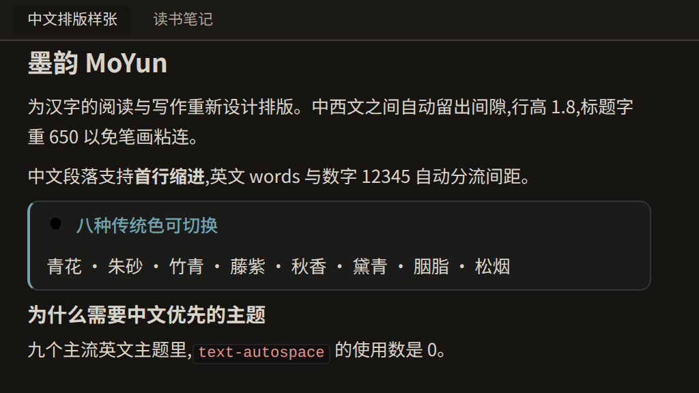
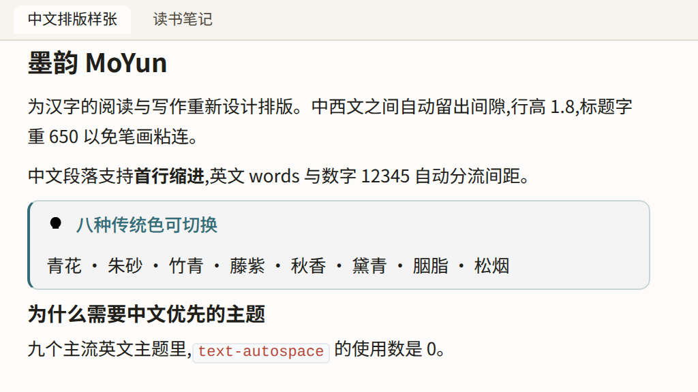
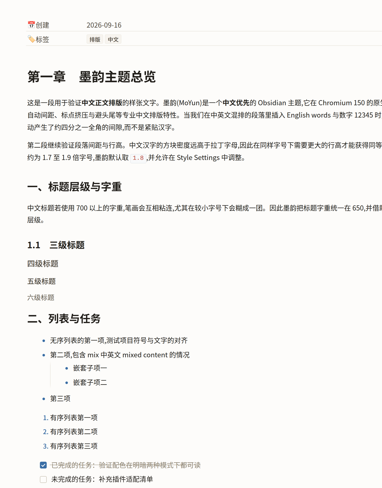
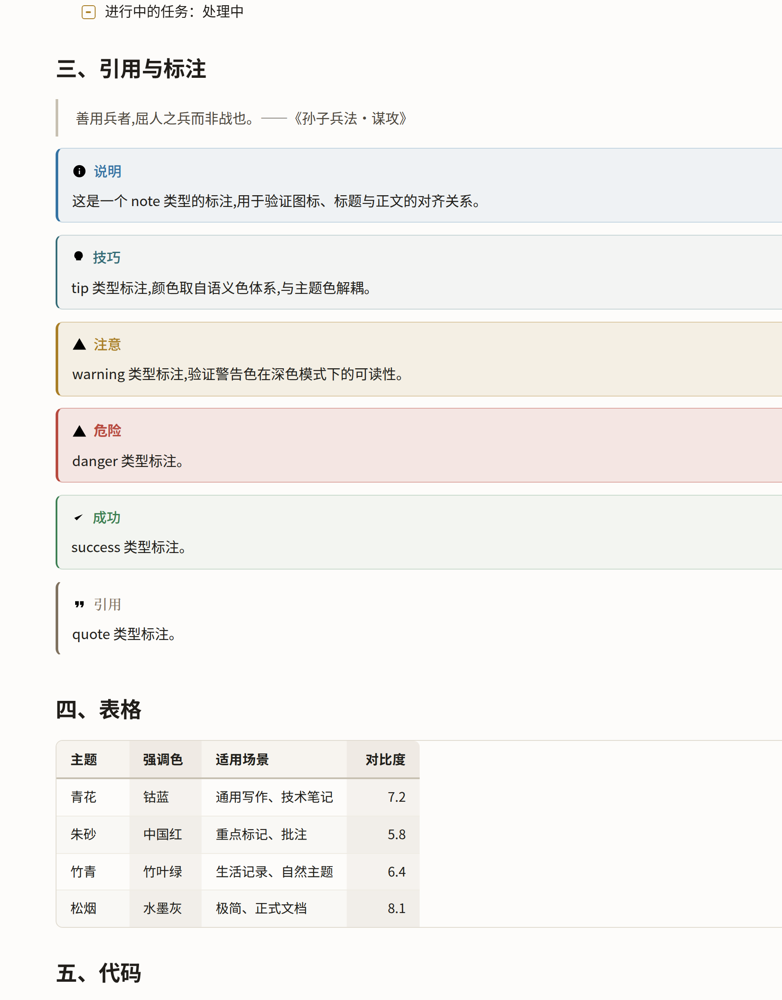
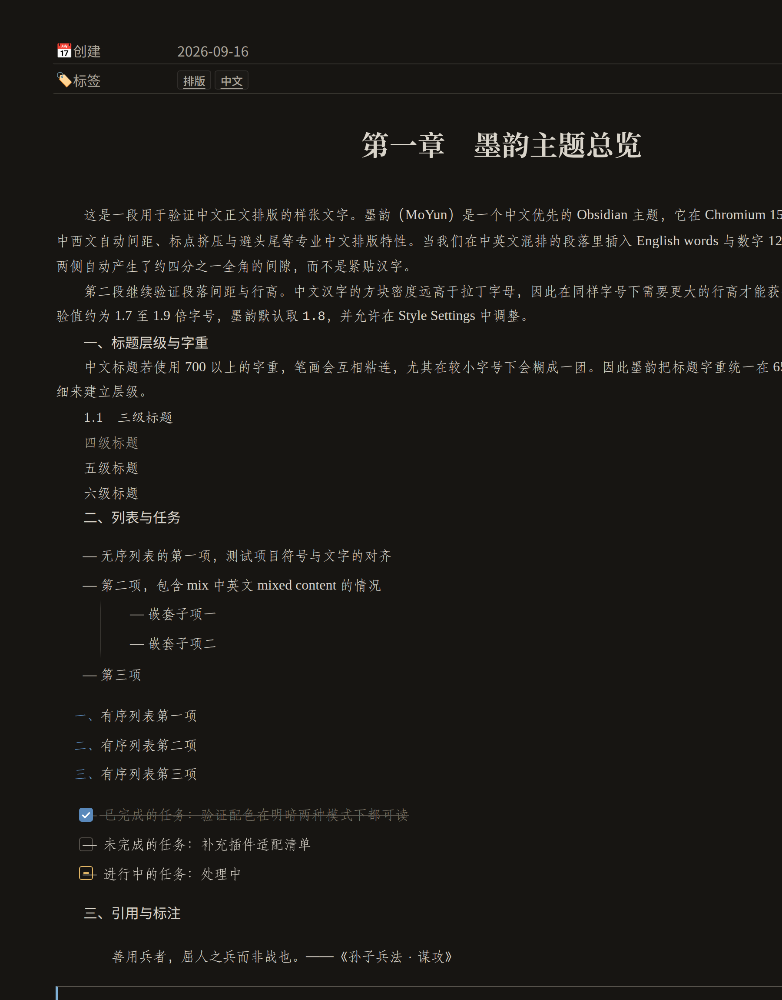
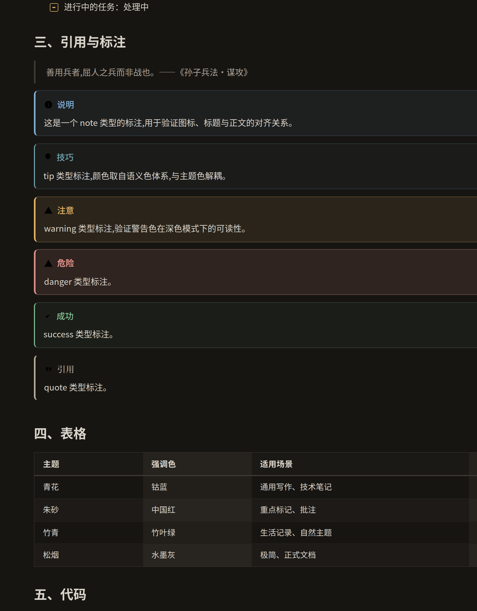

<div align="center">

# 墨韵 MoYun

**一个中文优先的 Obsidian 主题**

> 在 Obsidian 社区目录里的名字是 **MoYun**（官方要求主题名只用基本拉丁字符）。
> 「墨韵」是它的中文名 —— 取水墨之墨、余韵之韵。

为汉字的阅读与写作重新设计排版、配色与交互




</div>

---

<a id="sponsor"></a>

## 赞助

墨韵是业余时间做出来的：查规范、实测浏览器行为、写检查脚本，
光是为了搞清「为什么 Mermaid 图里的字会隐形」就翻过 Obsidian 的 asar 包。
如果它让你的中文阅读舒服了一点，欢迎扫码请我喝杯茶 —— **完全自愿，不影响任何功能**。

<table>
  <tr>
    <td align="center" width="50%">
      
      <br /><b>微信支付</b>
    </td>
    <td align="center" width="50%">
      
      <br /><b>支付宝</b>
    </td>
  </tr>
</table>

赞助之外，同样有帮助的三件事（详见 [SPONSOR.md](SPONSOR.md)）：

- 在社区目录里给它点个赞；
- 提 Issue 告诉我哪里不好用；
- 把它推荐给身边用中文写笔记的人。

---

## 为什么又做一个主题

Obsidian 上优秀的主题很多，但几乎都是为英文写作设计的。这不是「颜色好不好看」的问题，而是排版规则不成立 —— 把英文正文的行高直接套到中文上，读起来就是拥挤的。

我们统计了 9 个最流行的开源主题（Minimal、AnuPpuccin、Blue Topaz、Border、Maple、Primary、Things、Catppuccin、Sanctum）对中文排版的覆盖情况：

| 中文排版必需项 | 9 个主题中的命中数 | 后果 |
|---|---|---|
| 中文字体栈（CJK 字体族名） | **1 / 9** | 中文回退到系统默认字体，字形与字重都不可控 |
| `text-autospace` 中西文自动间距 | **0 / 9** | 中英混排糊成一团，没有排版级间隙 |
| `text-spacing-trim` 标点挤压 | **0 / 9** | 全角标点四周留白过大 |
| `text-indent` 首行缩进 | **1 / 9** | 段落界限只能靠段距，中文长文读起来费劲 |
| `line-break` 避头尾 | **0 / 9** | 行首出现句号、逗号等禁则标点 |
| 行高 ≥ 1.7 | 少数 | 汉字方块密度高，1.4～1.5 明显拥挤 |

墨韵把这六项全部补齐，并且是**用原生 CSS 实现**的 —— 不需要装任何 JS 插件，不会修改你的 `.md` 文件。

## 核心特性

### 一、中文排版，逐项做到位

- **中西文自动间距**：基于 CSS Text Level 4 的 `text-autospace`，在中文与英文、数字之间自动插入约 1/8 全角间隙。零 JS、零轮询、不污染原文。
- **行高与版心**：正文字号随窗口宽度自适应 —— 1280 宽的窗口是 16.2px，3840 宽的高分屏自动放大到 21.8px；版心按「一行 46 个汉字」折算，字号变大时版心同步变宽，任何屏幕上都保持同一阅读节律。基准字号取自 Obsidian 自己的「外观 → 字体大小」，主题不另立一套。
- **首行缩进**：一个开关，默认 2em（即 2 个汉字），并**自动豁免**列表、引用、代码、表格、公式、图片段落 —— 缩进不会把版面推歪。
- **标题字重 650**：中文标题用 700 以上会让笔画互相粘连，尤其在 14～18px 区间。墨韵用留白而非粗细建立层级。
- **不用伪斜体**：汉字没有真斜体，浏览器的强行倾斜会让字形失真。墨韵改用「变色 + 半粗」，并提供中文传统的**着重号**作为可选方案。
- **六种中文排版模式**：公文（GB/T 9704-2012）、诗词、论文、信纸、大字投屏、沉浸写作，用 `cssclasses` 一键切换。

### 二、八大韵色

八种取自中国传统色的强调色，每一种都按对比度标准校准过：

**青花**（默认）· **朱砂** · **竹青** · **藤紫** · **秋香** · **黛青** · **胭脂** · **松烟**

换色会同时作用于链接、标签、按钮、开关、滑块、选中态、标签页、设置项、有序列表编号、输入框焦点、图谱节点、Canvas 选中框 —— 整库观感统一。

### 三、日间「宣纸」/ 夜间「墨夜」

两个模式不是简单的反相：

- **日间**底色不用纯白，用带暖调的宣纸色（`#fdfcfa`），长时间阅读不刺眼
- **夜间**正文不用纯白，用**宣纸色文字**（`#d9d4ca`）压在深墨底上 —— 这是墨韵最核心的护眼设计，纯白在深底上的强对比是夜间阅读疲劳的主要来源

### 四、图表也随主题，两种风格可切换

Mermaid 图形（流程图 / 时序图 / 状态图 / 类图 / 饼图 / 甘特图）的节点、连线、标签、
分组全部走主题令牌，**明暗两种模式自动成立**，字号也跟着分辨率一起放大。

设置面板可选两种**图表风格**：

- **墨韵（默认）**：与主题同源的纸面插图。画布透明、节点只留轮廓、连线中性；
  文字与线带一圈同色柔光 —— 「亮晶晶」不靠加粗（汉字加粗会糊笔画），靠光。
  光晕颜色取自强调色，因此换「韵色」时整张图的光感也跟着换。
- **赛博霓虹**：深色终端画布 + 青蓝网格底纹，霓虹青描边、品红次级信息、冷白文字发光。
  画布**恒定深色**（霓虹是暗部里的光，铺在浅色纸面上只会变成一堆刺眼彩线），
  应用切到浅色模式时它依然是那块深色画布；打印时自动回落成素色线框。

图的处理遵循一条前提：**Mermaid 的图主要是「线 + 文字」，画布本身是透明的。**
所以默认风格不铺面板底色、节点只留轮廓、子图只留虚线框，图形直接落在纸面（或夜色）上。

三处必须显式接管，否则会出问题，都已写进注释与检查：

- Mermaid 把配色内联进 SVG 内部 ID 选择器的 `<style>`，外部 CSS 只能用 `!important` 覆盖；
  构建期为此设有 `@important-budget` 预算机制（声明预算 + 写明理由，否则构建报错）。
- 它同时写 `fill` 与 `color`：SVG `<text>` 看 `fill`，`foreignObject` 里的 HTML 看 `color`，
  只覆盖一个就会得到「文字和背景一个色」的隐形字。
- Obsidian 会给深色模式下的 Mermaid SVG 加 `filter: invert(100%) hue-rotate(180deg)`。
  那是给未做深色适配的图兜底的；主题既已逐色接管，就必须关掉它，否则整张图被反相成白块。

这些不靠人眼把关：`tools/check-mermaid.mjs` 用**真实 Mermaid 包 + Obsidian 的真实初始化参数**
渲染 2 种风格 × 明暗 2 模式 × 6 类图，逐元素实测对比度（全部 ≥ 4.5:1），
断言 SVG 上没有反相滤镜，并做「计算样式 vs 屏幕像素」对拍 —— 因为 `filter` 只改像素、
不改 `getComputedStyle`，只读计算样式的检查会在屏幕上全错时说通过。

### 五、全中文的设置面板

主题的 30 多个选项全部用中文说明，并且**每一组都写清了取舍**，而不是只给个滑杆：

> 「中文字距」的说明是：*推荐保持 0。字距会在每行最后一个字之后也追加空隙，调大后右边缘不再平齐；汉字本身等宽，加大字距只会显得松散。*

八组设置：排版基调 / 配色 / 中文排版 / 字体 / 行距与版心 / 界面细节 / 内容增强 / 高级

### 六、工程化

主题是**源码分模块 + 构建产出**的，不是一份 8000 行的 CSS 大文件：

```
36 个模块  →  node build.mjs  →  theme.css (459 KB)
```

- **构建期校验**：花括号配对、未定义令牌、原始色板越界引用、Style Settings 格式
- **模块冲突检查**：检测跨模块的「同一个属性有两个主人」，这是并行开发最容易埋的坑
- **视觉与计算样式验证**：用 Playwright 把主题渲染进 Obsidian 的真实 DOM，断言 59 项计算后样式（含「宽屏字号确实变大」「一行始终 46 字」等分辨率自适应实测）并输出明暗双模式截图
- **CI 与 BRAT 发布**：推 tag 自动构建、校验、发 Release

## 安装

### 手动安装（推荐先试）

1. 下载本仓库的 `theme.css` 与 `manifest.json`
2. 在你的库中创建目录 `.obsidian/themes/墨韵 MoYun/`
3. 把两个文件放进去（文件名不要改）
4. 打开 Obsidian → 设置 → 外观 → 主题 → 选择「墨韵 MoYun」

### 用 BRAT 自动更新

1. 安装社区插件 **BRAT**
2. 命令面板 → `BRAT: Add a beta theme`
3. 填入本仓库地址

### 强烈建议安装 Style Settings

主题的所有可调项都依赖社区插件 [Style Settings](https://github.com/mgmeyers/obsidian-style-settings)。不装也能用（会使用全部默认值），但无法调整字号、行高、行宽、首行缩进、八大韵色等选项。

## 快速上手

1. 安装主题并启用
2. 装 Style Settings，打开「墨韵 MoYun」分组
3. 试试这几项：
   - **主题色（八韵）** → 换一个韵色，看整库观感如何变
   - **首行缩进两字** → 打开，注意列表、引用、代码不会被推歪
   - **标题改用衬线字体** → 开启后标题变宋体，正文保持黑体

## 界面预览

### 日间「宣纸」







### 夜间「墨夜」





## 定制

主题用三层设计令牌组织样式，改令牌比改选择器稳得多：

```
第一层  原始色板     --my-ink-*  --my-qinghua-*      组件层禁止直接使用
第二层  语义令牌     --my-surface-*  --my-text-*     组件层应当使用
第三层  Obsidian 映射 --background-*  --text-*       组件层可以优先使用
```

写一个 CSS 片段就能做大部分定制：

```css
/* 收窄到一行 36 字、放宽行高 */
body {
  --my-content-chars: 36;
  --my-line-height-relaxed: 2.0;
}

/* 整体换成自定义强调色 */
body { --my-accent-custom: #7a5c3e; }

/* 关掉分辨率自适应，完全跟随 Obsidian 的字号设置 */
body { --my-font-auto-scale: 0; }
```

**字体与字号的归属**：主题只提供「兜底字体栈」，不抢你在 Obsidian 里的设置。
「设置 → 外观 → 字体」里选中的字体会自动接管正文（公文体下接管正文但**不接管标题**，
因为「靠字体区分层级」本身就是公文特征）；「设置 → 外观 → 字体大小」决定基准字号，
主题只在此基础上按窗口宽度做自适应放大。

完整的令牌白名单见 [`docs/dev/token-contract.md`](docs/dev/token-contract.md)。`snippets/` 目录还提供了三个可选增强：中文竖排、打印与导出优化、中文排版增强。

## 项目结构

```
obsRead/
├── theme.css                 构建产物（安装用，勿直接编辑）
├── manifest.json             Obsidian 主题清单
├── build.mjs                 构建与静态校验
├── src/                      模块化源码（36 个模块）
│   ├── 00-tokens/            设计令牌：色板 / 语义 / 设置面板 / Obsidian 映射
│   ├── 10-foundation/        基础：重置、中文排版核心
│   ├── 15-govdoc/            公文风格（GB/T 9704-2012，默认开启）
│   ├── 20-layout/            布局：工作区、侧栏、标签页、状态栏、设置界面
│   ├── 30-editor/            编辑器内容：标题、列表、表格、代码、引用、媒体
│   ├── 40-components/        组件：标注、复选框、标签、浮层、表单
│   ├── 50-features/          增强：彩虹文件夹、卡片、图片网格、专注、标题编号
│   └── 60-plugins/           插件适配：Dataview、Tasks、Kanban、Excalidraw 等
├── snippets/                 可选 CSS 片段
├── presets/                  五套 Style Settings 预设
├── demo-vault/               演示库（直接用 Obsidian 打开即可看到效果）
├── tools/                    构建与验证工具
└── docs/                     文档与参考资料
```

## 开发

首次开始开发前，先提取一份本机 Obsidian 的样式表作为参考（不随仓库分发）：

```bash
node tools/extract-obsidian-reference.mjs   # 从本机 Obsidian 提取 app.css 与变量清单
```

> 为什么这一步要自己做：Obsidian 是闭源商业软件，其完整样式表受版权保护，不适合随
> MIT 开源主题一起分发；但开发时确实需要核对它定义了哪些 CSS 变量与选择器，因此改为
> 由每位贡献者从自己合法安装的 Obsidian 中提取。提取结果已在 `.gitignore` 中排除。

```bash
node build.mjs                 # 构建并校验
node build.mjs --watch         # 监听源码变化自动重建
node build.mjs --check         # 只校验不写文件（CI 用）
node tools/check-conflicts.mjs # 模块冲突检查（--strict 供 CI 使用）
node tools/verify.mjs          # 视觉与计算样式验证（需要本机 Chrome）
node tools/make-demo-vault.mjs # 重新生成演示库
```

修改 `src/` 下的任何文件后都要重新构建，`theme.css` 是产物。

## 能力边界（诚实说明）

有几件中文排版上很想要的事，在当前 Obsidian 的渲染引擎里**做不到**，这里如实列出，不假装支持：

| 想要的效果 | 现状 | 原因 |
|---|---|---|
| 标点挤压（`text-spacing-trim`） | 声明了但**实际无效果** | 该属性依赖字体的 `chws` 特性，而思源黑体 / Noto Sans CJK 只提供 `halt` 与 `palt`。主题保留声明（将来字体具备时可自动受益），并提供基于 `halt` 的「紧凑标点」开关作为替代 |
| 标点悬挂（`hanging-punctuation`） | **不支持** | Chromium 从未实现该属性（只有 Safari 有） |
| 避头尾的 CSS 控制 | 无需控制 | Chromium 默认**已强制**执行中文避头尾；主题保留 `line-break: strict` 仅为防御性声明 |
| 按词组智能断行 | 仅日文有效 | `word-break: auto-phrase` 依赖引擎内置词典，Chromium 只随附日文词典，对中文无效果 |
| 实时预览下的标题自动编号 | **不支持** | CodeMirror 采用虚拟滚动，屏幕外的行没有 DOM，CSS 计数器会随滚动跳变。宁可只在阅读视图编号，也不给一个会变的假编号 |

## 兼容性

- **Obsidian 1.6.0 及以上**（`manifest.json` 中的 `minAppVersion`）
- 中文排版的新特性（`text-autospace`）需要 **Chromium 136 以上**。Obsidian 1.13.x 内置 Chromium 150，完全支持；更低版本会自动降级，不影响其它样式。
- 桌面端与移动端均已适配（移动端会统一表面层次，避免窄屏被切成太多色块）

## 致谢

墨韵在设计过程中通读了以下开源主题的源码，从中借鉴了大量思路（详见 `docs/research/`）：

- [Minimal](https://github.com/kepano/obsidian-minimal) —— 容器变量间接层、卡片与图片网格
- [AnuPpuccin](https://github.com/AnubisNekhet/AnuPpuccin) —— 彩虹文件夹、Style Settings 组织方式
- [Blue Topaz](https://github.com/PKM-er/Blue-Topaz_Obsidian-css) —— 中文字体栈的先行者
- [Border](https://github.com/Akifyss/obsidian-border) —— 多 `@settings` 块与预设分发
- [Maple](https://github.com/subframe7536/obsidian-theme-maple) —— 中文主题的工程化标杆
- [Catppuccin](https://github.com/catppuccin/obsidian) —— CSS 质量门禁
- [Primary](https://github.com/ceciliamay/obsidian-theme-primary)、[Things](https://github.com/colineckert/obsidian-things)
- [Dune](https://github.com/Jopp-gh/Obsidian-Dune84) —— 本项目的起点参考

命名、配色与全部代码为本项目原创。

## 许可

[MIT](LICENSE)
